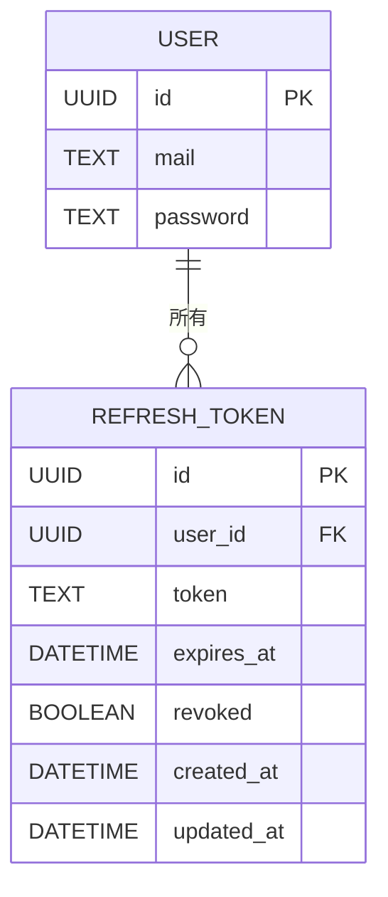

# リフレッシュトークン管理 ER図

```mermaid
erDiagram
    USER {
        UUID id PK
        TEXT mail
        TEXT password
    }
    REFRESH_TOKEN {
        UUID id PK
        UUID user_id FK
        TEXT token
        DATETIME expires_at
        BOOLEAN revoked
        DATETIME created_at
        DATETIME updated_at
    }

    USER ||--o{ REFRESH_TOKEN : 所有
```

## 補足

- リフレッシュトークンはユーザーごとに複数発行可能です。
- tokenカラムは漏洩対策のためハッシュ化保存が推奨されます。
- revokedやexpires_atで有効性を管理します。
- id, user_idはUUID型を使用してください。
- USERテーブルはmailアドレスで一意にユーザーを識別します。
