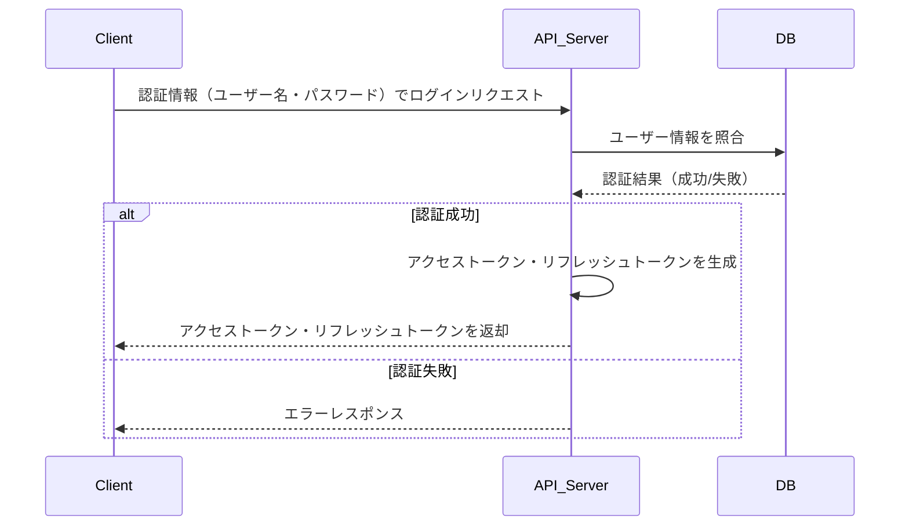
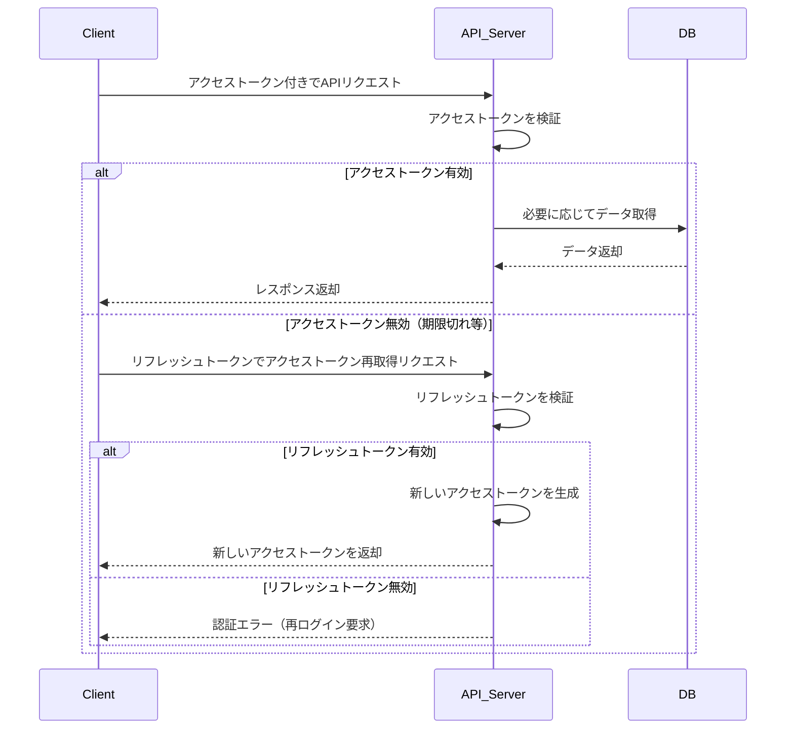
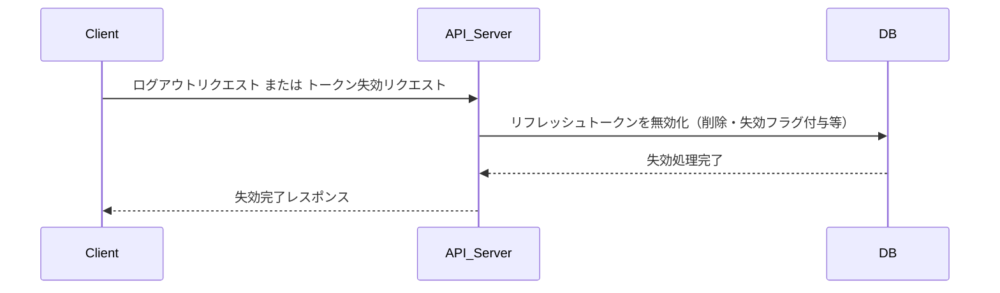

# トークンベース認証シーケンス図

以下は、JWTを利用した認証フローのシーケンス図です。

---

## 1. 初回認証・トークン発行

---

## 2. 通常APIリクエスト

---

## 3. リフレッシュトークン失効（ログアウト・漏洩時など）

---

## 補足

- アクセストークン・リフレッシュトークンはHTTPヘッダーやCookie等で送信してください。
- アクセストークンの検証には署名や有効期限の確認が含まれます。
- リフレッシュトークンは安全に管理し、漏洩時は失効処理を行ってください。
- 失効処理は、DB等でリフレッシュトークンを無効化することで再利用を防ぎます。
