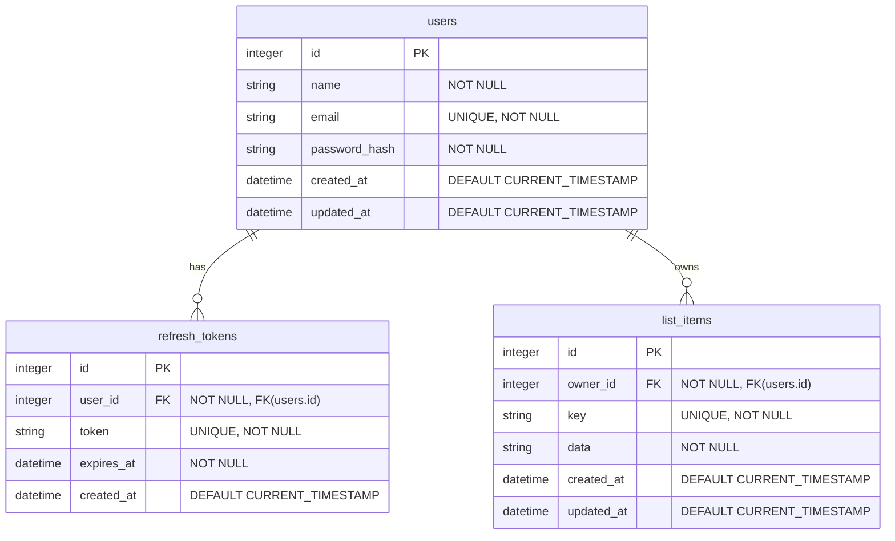

# ER図

```mermaid
erDiagram
    users ||--o{ refresh_tokens : "has"
    users ||--o{ list_items : "owns"

    users {
        integer id PK
        string name "NOT NULL"
        string email "UNIQUE, NOT NULL"
        string password_hash "NOT NULL"
        datetime created_at "DEFAULT CURRENT_TIMESTAMP"
        datetime updated_at "DEFAULT CURRENT_TIMESTAMP"
    }

    refresh_tokens {
        integer id PK
        integer user_id FK "NOT NULL, FK(users.id)"
        string token "UNIQUE, NOT NULL"
        datetime expires_at "NOT NULL"
        datetime created_at "DEFAULT CURRENT_TIMESTAMP"
    }

    list_items {
        integer id PK
        integer owner_id FK "NOT NULL, FK(users.id)"
        string key "UNIQUE, NOT NULL"
        string data "NOT NULL"
        datetime created_at "DEFAULT CURRENT_TIMESTAMP"
        datetime updated_at "DEFAULT CURRENT_TIMESTAMP"
    }
```
