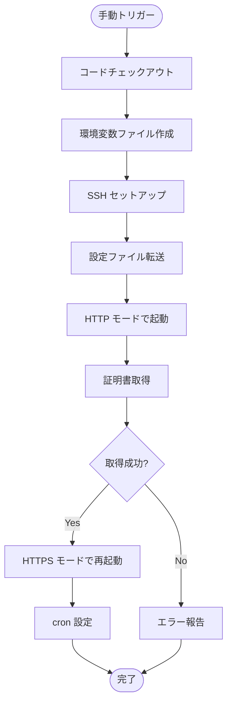

# GitHub Actions SSL セットアップ仕様

## 概要

GitHub Actions を使用した SSL 証明書の初回セットアップワークフローの仕様を定義します。

## ワークフロー定義

| 項目     | 値                                 |
| -------- | ---------------------------------- |
| ファイル | `.github/workflows/setup-ssl.yaml` |
| トリガー | `workflow_dispatch`（手動実行）    |
| 実行環境 | `ubuntu-latest`                    |

## 追加シークレット

既存のシークレットに加えて、以下のシークレットが必要です。

| シークレット名      | 説明                       | 例                  | 必須 |
| ------------------- | -------------------------- | ------------------- | ---- |
| `DOMAIN_NAME`       | 証明書を取得するドメイン   | `example.com`       | Yes  |
| `LETSENCRYPT_EMAIL` | Let's Encrypt 通知用メール | `admin@example.com` | Yes  |

### 既存シークレット（参照）

| シークレット名           | 説明                         |
| ------------------------ | ---------------------------- |
| `SSH_PRIVATE_KEY`        | SSH 秘密鍵                   |
| `SSH_HOST`               | サーバーホスト名/IP          |
| `SSH_USER`               | SSH ユーザー名               |
| `SSH_PORT`               | SSH ポート                   |
| `DEPLOY_PATH`            | デプロイ先パス               |
| `JWT_SECRET`             | JWT 署名用秘密鍵             |
| `JWT_ACCESS_EXPIRATION`  | アクセストークン有効期限     |
| `JWT_REFRESH_EXPIRATION` | リフレッシュトークン有効期限 |
| `DOCKER_USERNAME`        | Docker Hub ユーザー名        |
| `DOCKER_PASSWORD`        | Docker Hub パスワード        |

## ワークフロー実行ステップ

## 実行前提条件

### サーバー側

- [ ] Docker がインストールされている
- [ ] Docker Compose がインストールされている
- [ ] SSH 接続が可能
- [ ] ポート 80, 443 がファイアウォールで開放されている
- [ ] ドメインの DNS が正しく設定されている

### GitHub 側

- [ ] 全ての必須シークレットが設定されている
- [ ] ワークフローの実行権限がある

## トラブルシューティング

### 証明書取得に失敗する場合

| 症状           | 確認事項                                          |
| -------------- | ------------------------------------------------- |
| DNS 検証失敗   | ドメインの A レコードがサーバー IP を指しているか |
| ポート到達不可 | ファイアウォールでポート 80 が開放されているか    |
| Rate Limit     | Let's Encrypt の制限に達していないか              |

### ワークフローが失敗する場合

| 症状              | 確認事項                                       |
| ----------------- | ---------------------------------------------- |
| SSH 接続エラー    | SSH_PRIVATE_KEY, SSH_HOST, SSH_USER が正しいか |
| Permission denied | SSH ユーザーに適切な権限があるか               |
| Docker エラー     | Docker が起動しているか                        |
