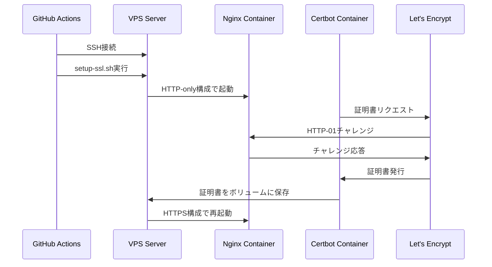
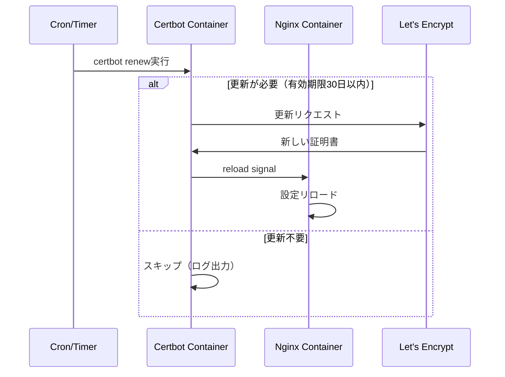
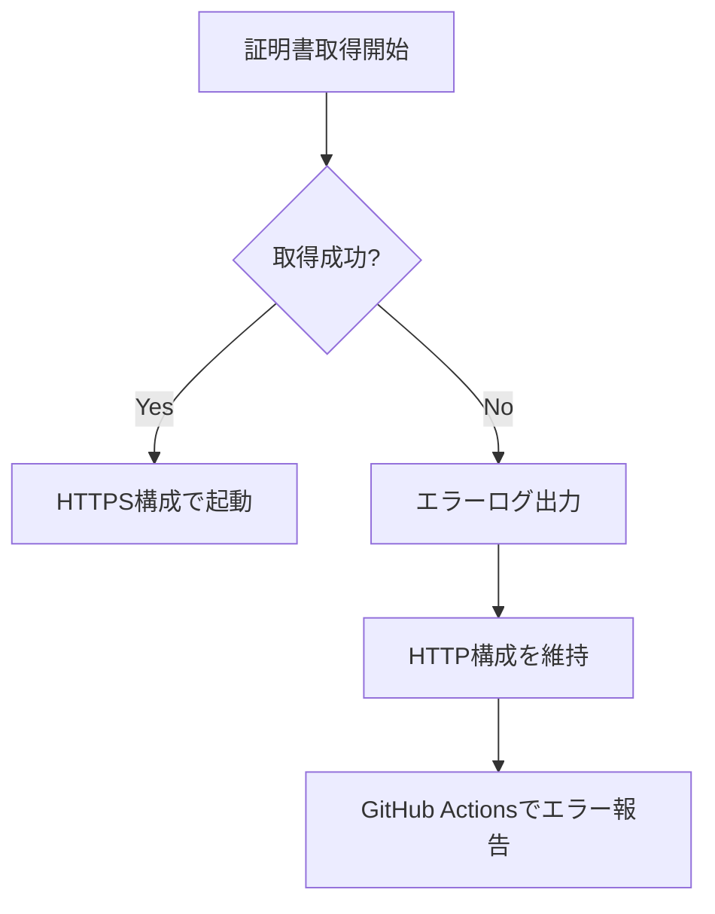

# SSL 証明書フロー

## 概要

Let's Encrypt を使用した SSL 証明書の取得・更新フローを定義します。

## 証明書取得フロー

初回セットアップ時に GitHub Actions から実行される証明書取得のフローです。

## 証明書更新フロー

定期的に実行される証明書更新のフローです。

### 更新スケジュール

| 項目                         | 値                 |
| ---------------------------- | ------------------ |
| Let's Encrypt 証明書有効期限 | 90 日              |
| Certbot 更新開始タイミング   | 有効期限の 30 日前 |
| 更新チェック間隔             | 12 時間            |
| cron 式                      | `0 */12 * * *`     |

## エラーハンドリング

### 証明書取得失敗時

| 状態       | 動作                        |
| ---------- | --------------------------- |
| 取得成功   | HTTPS 構成で Nginx を再起動 |
| 取得失敗   | HTTP 構成のまま継続稼働     |
| エラー通知 | GitHub Actions のログに出力 |

### 証明書更新失敗時

| 状態       | 動作                                            |
| ---------- | ----------------------------------------------- |
| 更新成功   | 新しい証明書で Nginx をリロード                 |
| 更新失敗   | 既存の証明書で継続稼働                          |
| エラー通知 | 有効期限が近づくと Let's Encrypt からメール警告 |
