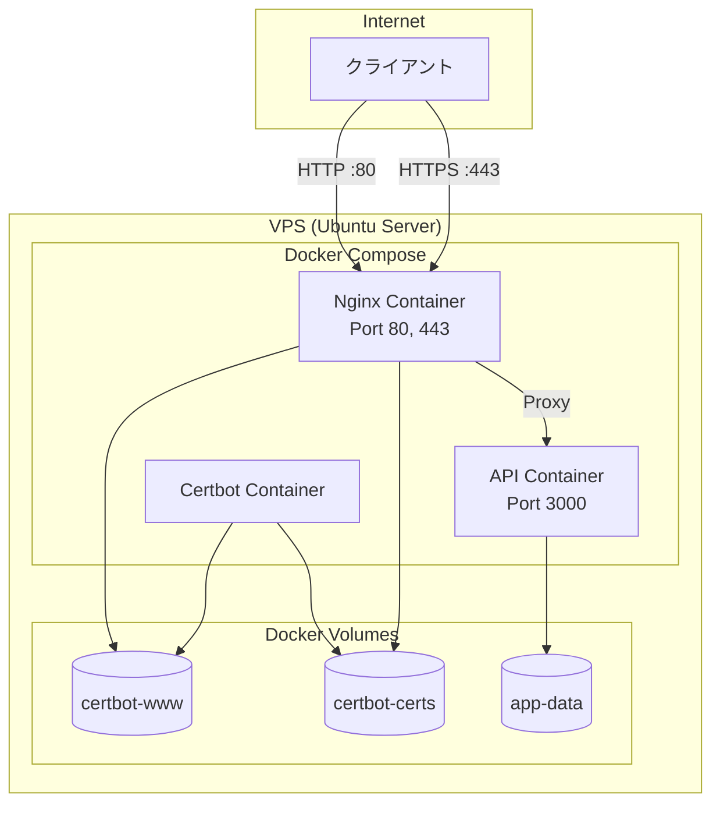
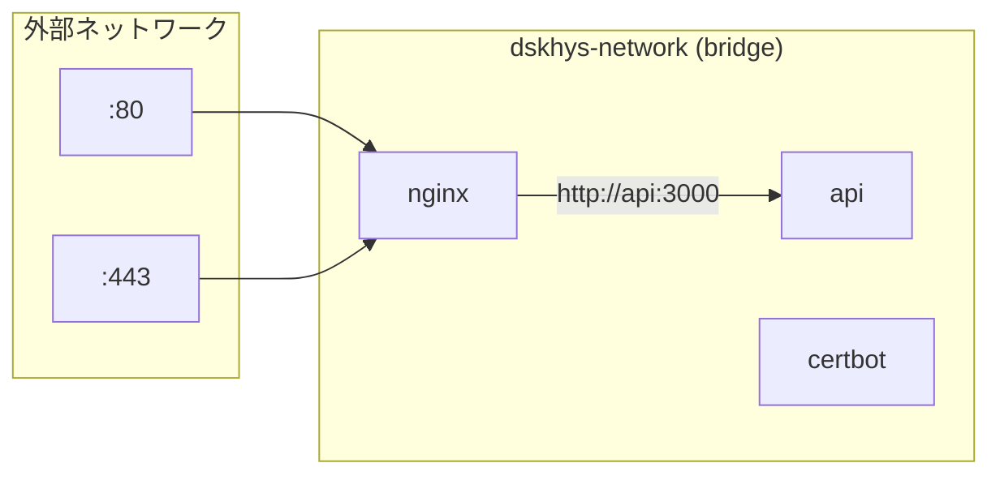

# システム構成図

## 概要

VPS 上に Docker Compose で構成されたアプリケーション環境のシステム構成を示します。

## 全体構成図

## コンポーネント説明

### Nginx Container

- **役割**: リバースプロキシ、SSL 終端、静的ファイル配信
- **ポート**: 80（HTTP）、443（HTTPS）

### API Container

- **役割**: REST API サーバー
- **ポート**: 3000（内部のみ）

### Certbot Container

- **役割**: SSL 証明書の取得・更新
- **実行モード**: 一時的（証明書操作時のみ）

## ボリューム説明

| ボリューム名    | 用途                          | マウント先（Nginx）   | マウント先（Certbot） |
| --------------- | ----------------------------- | --------------------- | --------------------- |
| `certbot-certs` | SSL 証明書・秘密鍵の永続化    | `/etc/letsencrypt:ro` | `/etc/letsencrypt`    |
| `certbot-www`   | ACME チャレンジファイルの共有 | `/var/www/certbot:ro` | `/var/www/certbot`    |
| `app-data`      | アプリケーションデータ        | -                     | -                     |

## ネットワーク構成

## 通信フロー

### HTTPS リクエスト

1. クライアントが `:443` に HTTPS リクエスト
2. Nginx が SSL 終端処理
3. Nginx が API コンテナにプロキシ
4. API がレスポンスを返却
5. Nginx がクライアントに HTTPS で応答

### HTTP リクエスト（リダイレクト）

1. クライアントが `:80` に HTTP リクエスト
2. Nginx が `301 Redirect` で HTTPS へリダイレクト
3. クライアントが HTTPS で再リクエスト
