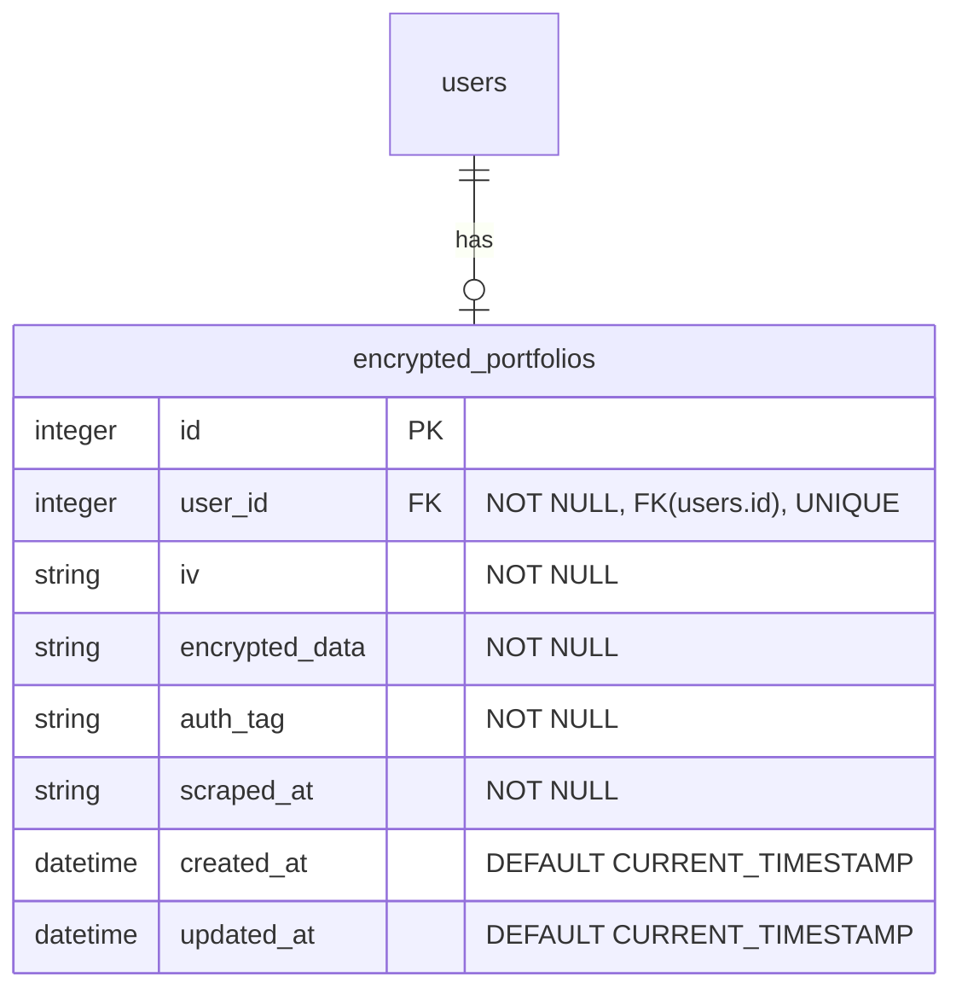
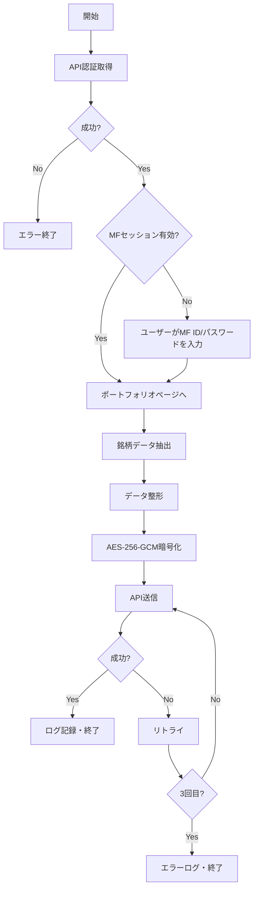
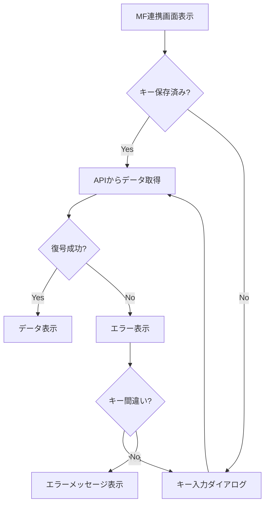

# 仕様書：マネーフォワード連携（ポートフォリオ銘柄自動取得）

対象要件：`docs/requirements/portfolio-moneyforward-scraping.md`

## システム概要

マネーフォワードからポートフォリオデータをスクレイピングし、暗号化してサーバーに保存。
Portfolio アプリで復号して表示するシステム。

## コンポーネント構成

```txt
packages/
├── client/
│   ├── portfolio/
│   │   └── src/
│   │       ├── utils/
│   │       │   └── crypto.ts     # 新規作成（復号処理）
│   │       └── stores/
│   │           └── mfStore.ts    # 新規作成（MF連携データ管理）
│   └── mf-scraper/           # 新規作成（スクレイピングバッチ）
│       ├── package.json
│       ├── tsconfig.json
│       └── src/
│           ├── index.ts      # エントリーポイント
│           ├── login.ts      # 初回ログイン
│           ├── scraper.ts    # スクレイピングロジック
│           ├── encrypt.ts    # 暗号化処理
│           ├── api.ts        # API送信
│           └── config.ts     # 設定読み込み
└── server/
    └── api/
        └── src/
            ├── routes/
            │   └── portfolio.ts  # 新規作成（API エンドポイント）
            └── repository/
                └── portfolioRepository.ts  # 新規作成
```

---

## 1. データベース設計

### 新規テーブル: `encrypted_portfolios`

```sql
CREATE TABLE encrypted_portfolios (
    id INTEGER PRIMARY KEY AUTOINCREMENT,
    user_id INTEGER NOT NULL,
    iv TEXT NOT NULL,              -- Base64エンコードされたIV（12バイト）
    encrypted_data TEXT NOT NULL,  -- Base64エンコードされた暗号文
    auth_tag TEXT NOT NULL,        -- Base64エンコードされた認証タグ（16バイト）
    scraped_at TEXT NOT NULL,      -- スクレイピング日時（ISO 8601）
    created_at TEXT DEFAULT CURRENT_TIMESTAMP,
    updated_at TEXT DEFAULT CURRENT_TIMESTAMP,
    FOREIGN KEY (user_id) REFERENCES users(id),
    UNIQUE(user_id)                -- 1ユーザー1レコード
);
```

### ER 図（追加分）



---

## 2. 暗号化仕様

### アルゴリズム

- **方式**: AES-256-GCM（認証付き暗号）
- **キー長**: 256 ビット（32 バイト）
- **IV 長**: 96 ビット（12 バイト）
- **認証タグ長**: 128 ビット（16 バイト）

### 暗号化キー生成

```bash
# 32バイトのランダムキーを生成（Base64）
openssl rand -base64 32
```

### 平文データ構造（暗号化前）

```typescript
interface PortfolioData {
  stocks: MFStock[];
  scrapedAt: string; // ISO 8601
}

interface MFStock {
  name: string; // 銘柄名
  units: number; // 保有数
  averageCost: number; // 平均取得単価
  currentPrice: number; // 基準価額
  value: number; // 評価額
  profitLoss: number; // 評価損益
  account: string; // 保有金融機関
}
```

### 暗号化後データ構造

```typescript
interface EncryptedData {
  iv: string; // Base64エンコードされたIV
  data: string; // Base64エンコードされた暗号文
  tag: string; // Base64エンコードされた認証タグ
}
```

### 暗号化処理フロー

```txt
平文JSON → JSON.stringify → UTF-8バイト列 → AES-256-GCM暗号化 → Base64エンコード
```

### 復号処理フロー

```txt
Base64デコード → AES-256-GCM復号 → UTF-8文字列 → JSON.parse → 平文JSON
```

---

## 3. バッチ処理設計（mf-scraper）

### パッケージ構成

```json
{
  "name": "@dskhys/mf-scraper",
  "version": "0.0.1",
  "type": "module",
  "scripts": {
    "start": "tsx src/index.ts",
    "login": "tsx src/login.ts"
  },
  "dependencies": {
    "playwright": "^1.40.0"
  },
  "devDependencies": {
    "typescript": "~5.9.3",
    "tsx": "^4.21.0",
    "@types/node": "^24.10.4"
  }
}
```

### 設定ファイル仕様

**パス**: `~/.config/mf-scraper/config.json`

```json
{
  "encryptionKey": "Base64エンコードされた32バイトのキー",
  "apiUrl": "https://api.example.com",
  "apiUsername": "APIサーバーのユーザー名",
  "apiPassword": "APIサーバーのパスワード"
}
```

**パーミッション**: `600`（所有者のみ読み書き可）

### セッションファイル仕様

**パス**: `~/.config/mf-scraper/auth.json`

Playwright の `storageState` 形式で保存。

**パーミッション**: `600`

### 処理フロー



### 実行時のユーザー入力

**実行コマンド**:

```bash
cd ~/path/to/mf-scraper
node dist/index.js
```

**入力プロンプト**:

```txt
MoneyForward Email: user@example.com
MoneyForward Password: ****
MoneyForward 2FA Code: 123456
```

※ セッションが有効な場合はこれらの入力は不要

### スクレイピング対象

**URL**: `https://moneyforward.com/bs/portfolio`

**抽出対象セレクタ**（実装時に確認・調整必要）:

```typescript
// 例：セレクタは実際のページ構造に合わせて調整
const selectors = {
  stockRow: ".portfolio-table tbody tr",
  name: ".name-column",
  units: ".units-column",
  averageCost: ".average-cost-column",
  currentPrice: ".current-price-column",
  value: ".value-column",
  profitLoss: ".profit-loss-column",
  account: ".account-column",
};
```

### 初回ログインスクリプト（login.ts）

手動で 2FA コードを入力してセッションを保存するスクリプト。

```bash
node dist/login.js
```

**処理**:

1. ブラウザを表示モードで起動
2. マネーフォワードログインページへ
3. ユーザーがマネーフォワード ID/パスワードを入力
4. ユーザーが 2FA コードを入力
5. ログイン完了を検知
6. セッションを auth.json に保存

---

## 4. API 設計

### エンドポイント一覧

| メソッド | パス                       | 説明               |
| -------- | -------------------------- | ------------------ |
| POST     | `/api/portfolio/encrypted` | 暗号化データの登録 |
| GET      | `/api/portfolio/encrypted` | 暗号化データの取得 |

### POST /api/portfolio/encrypted

**説明**: ローカル PC から暗号化データを登録

**認証**: 必須（JWT）

**リクエストボディ**:

```typescript
interface CreateEncryptedPortfolioRequest {
  iv: string; // Base64エンコードされたIV
  data: string; // Base64エンコードされた暗号文
  tag: string; // Base64エンコードされた認証タグ
  scrapedAt: string; // ISO 8601形式の日時
}
```

**バリデーション**:

```typescript
const CreateEncryptedPortfolioSchema = z.object({
  iv: z.string().min(1),
  data: z.string().min(1),
  tag: z.string().min(1),
  scrapedAt: z.string().datetime(),
});
```

**レスポンス**:

```typescript
// 成功時（201 Created）
interface CreateEncryptedPortfolioResponse {
  success: true;
  message: string;
}

// エラー時（400 Bad Request / 401 Unauthorized / 500 Internal Server Error）
interface ErrorResponse {
  success: false;
  error: string;
}
```

### GET /api/portfolio/encrypted

**説明**: 暗号化データを取得

**認証**: 必須（JWT）

**レスポンス**:

```typescript
// 成功時（200 OK）
interface GetEncryptedPortfolioResponse {
  iv: string;
  data: string;
  tag: string;
  scrapedAt: string;
  updatedAt: string;
}

// データなし（404 Not Found）
interface NotFoundResponse {
  success: false;
  error: "Portfolio data not found";
}
```

---

## 5. クライアント設計（Portfolio アプリ）

### 復号処理（Web Crypto API）

**ファイル**: `src/utils/crypto.ts`

```typescript
interface DecryptParams {
  iv: string; // Base64
  data: string; // Base64
  tag: string; // Base64
  key: string; // Base64
}

interface DecryptResult {
  success: true;
  data: PortfolioData;
}

interface DecryptError {
  success: false;
  error: string;
}

type DecryptResponse = DecryptResult | DecryptError;

async function decrypt(params: DecryptParams): Promise<DecryptResponse>;
```

### 状態管理（zustand）

**ファイル**: `src/stores/mfStore.ts`

```typescript
interface MFState {
  // 状態
  encryptionKey: string | null;
  portfolioData: PortfolioData | null;
  isLoading: boolean;
  error: string | null;
  lastUpdated: string | null;

  // アクション
  setEncryptionKey: (key: string) => void;
  fetchAndDecrypt: () => Promise<void>;
  clearData: () => void;
}
```

### UI フロー



### キー保存

- **保存先**: `localStorage`
- **キー名**: `mf-encryption-key`
- **注意**: ローカルストレージはユーザーのブラウザに保存されるため、
  サーバーには送信されない

---

## 6. 定期実行設定

### systemd timer（推奨）

**サービスファイル**: `~/.config/systemd/user/mf-scraper.service`

```ini
[Unit]
Description=MoneyForward Portfolio Scraper

[Service]
Type=oneshot
WorkingDirectory=/path/to/mf-scraper
ExecStart=/usr/bin/node dist/index.js
```

**タイマーファイル**: `~/.config/systemd/user/mf-scraper.timer`

```ini
[Unit]
Description=Run MF Scraper daily

[Timer]
OnCalendar=*-*-* 07:00:00
Persistent=true

[Install]
WantedBy=timers.target
```

**有効化コマンド**:

```bash
systemctl --user daemon-reload
systemctl --user enable mf-scraper.timer
systemctl --user start mf-scraper.timer
```

### cron（代替）

```bash
# 毎日午前7時に実行
0 7 * * * cd /path/to/mf-scraper && /usr/bin/node dist/index.js >> ~/mf-scraper.log 2>&1
```

---

## 7. エラーハンドリング

### エラーコード一覧

| コード | 説明                     | 対処                     |
| ------ | ------------------------ | ------------------------ |
| E001   | 設定ファイル読み込み失敗 | 設定ファイルを確認       |
| E002   | セッション無効           | login.ts で再ログイン    |
| E003   | スクレイピング失敗       | セレクタを確認・更新     |
| E004   | 暗号化失敗               | キーを確認               |
| E005   | API 送信失敗             | ネットワーク・認証を確認 |
| E006   | 復号失敗（クライアント） | キーを再入力             |

### ログ出力

```typescript
interface LogEntry {
  timestamp: string;
  level: "INFO" | "WARN" | "ERROR";
  code?: string;
  message: string;
  details?: unknown;
}
```

**ログファイル**: `~/.config/mf-scraper/logs/YYYY-MM-DD.log`

---

## 8. セキュリティ考慮事項

### 暗号化キーの管理

1. **生成**: `openssl rand -base64 32` で生成
2. **保管（バッチ）**: `~/.config/mf-scraper/config.json`（パーミッション 600）
3. **保管（クライアント）**: ユーザーがブラウザの localStorage に保存
4. **サーバー**: 暗号化キーは一切保管しない

### サーバーデータ流出時の影響

- サーバーには暗号化データのみ保存
- 暗号化キーがなければ復号不可
- **リスク**: 低（暗号化キーを持たない限り意味のないデータ）

### 認証情報の保護

- **マネーフォワード ID/パスワード**: ユーザー入力のため、バッチプロセスメモリにのみ保持（永続保存なし）
- **API サーバー ID/パスワード**: 設定ファイルに保存（パーミッション 600）
- **セッション情報**: Playwright の storageState で管理（パーミッション 600）
- **2FA**: セッション有効期限内は再認証不要

---

## 9. 実装優先順位

1. **サーバー API**（POST/GET エンドポイント）
2. **DB マイグレーション**（encrypted_portfolios テーブル）
3. **バッチ処理**（mf-scraper パッケージ）
4. **クライアント復号処理**（crypto.ts）
5. **クライアント UI**（MF 連携画面）
6. **定期実行設定**（systemd timer）
