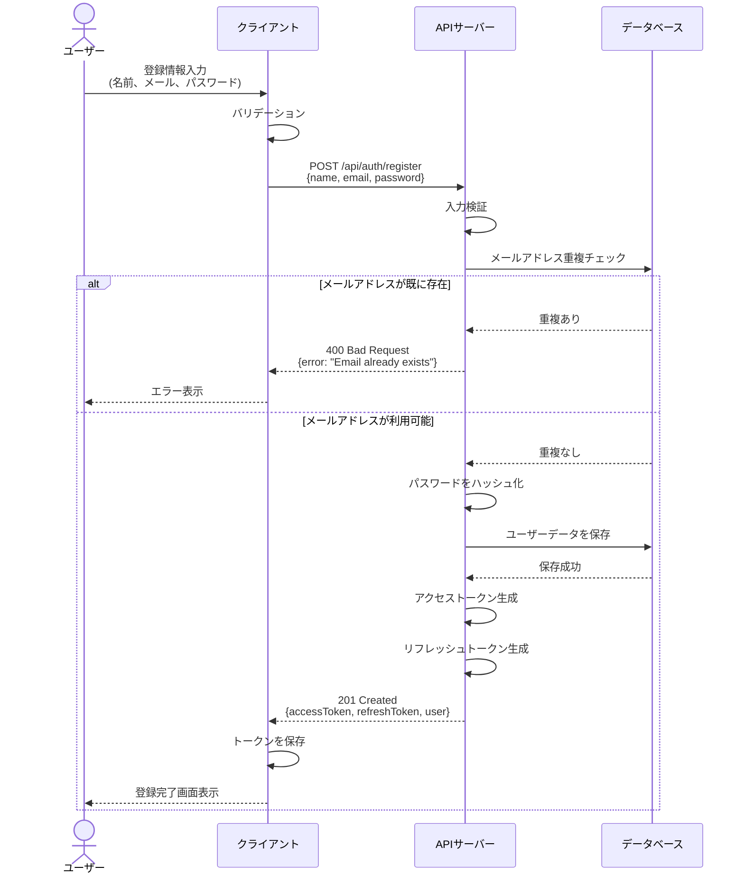
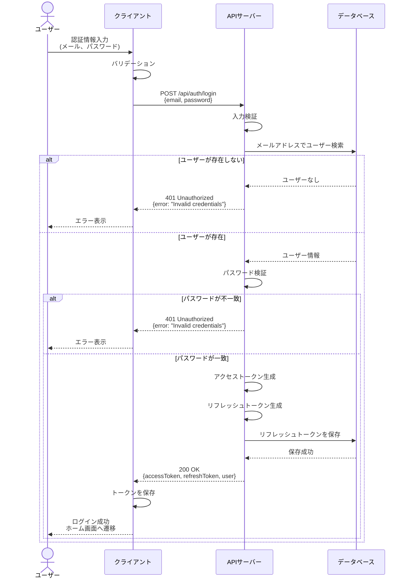
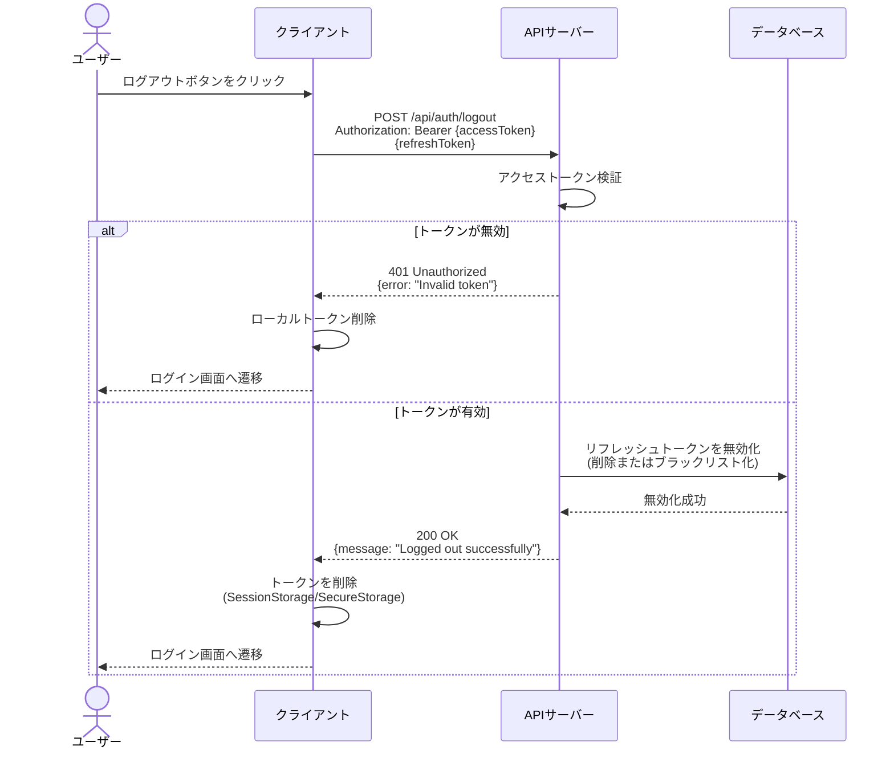
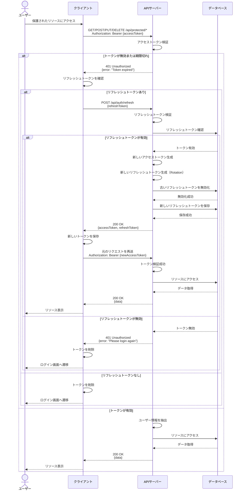

# 認証フロー

本ドキュメントでは、システムの認証関連のフローを説明します。

## 概要

認証方式には JWT（JSON Web Token）を使用します。

- **アクセストークン**: 短期間有効（例：15 分）
- **リフレッシュトークン**: 長期間有効（例：7 日）

## 1. 会員登録フロー

ユーザーが新規アカウントを作成する際のフローです。



## 2. ログインフロー

登録済みユーザーがシステムにログインする際のフローです。



## 3. ログアウトフロー

ログイン中のユーザーがシステムからログアウトする際のフローです。



## 4. 要認証 API での認証フロー

保護された API エンドポイントにアクセスする際の認証フローです。



## セキュリティ考慮事項

### トークンの保存

#### 認証方式の選択

Web と スマホアプリで共通の JWT ベース認証を採用:

- Authorization ヘッダーで `Bearer {accessToken}` を送信
- Cookie は使用しない（クロスプラットフォーム対応のため）

#### プラットフォーム別の保存方法

**Web (ブラウザ / PWA):**

- **アクセストークン**:
  - メモリ内（変数として保持）が最も安全
  - または SessionStorage（タブを閉じると削除、XSS リスクあり）
- **リフレッシュトークン**:
  - **推奨: IndexedDB + Web Crypto API で暗号化**（PWA のオフライン対応、永続化）
  - ※ XSS 対策として Content Security Policy (CSP) を設定すること
  - ※ Web Crypto API を使えば OS の暗号化機能 (TPM など) を活用可能

**スマホアプリ (React Native / Flutter など):**

- **アクセストークン**:
  - SecureStorage（iOS: Keychain、Android: Keystore）
- **リフレッシュトークン**:
  - SecureStorage（iOS: Keychain、Android: Keystore）
  - ネイティブの暗号化機能により安全に保存

**セキュリティ上の注意:**

- Web では localStorage/SessionStorage は JavaScript からアクセス可能なため XSS 攻撃のリスクあり
- アクセストークンの有効期限を短く（15 分程度）することでリスクを軽減
- リフレッシュトークンは長期間有効だが、ローテーション方式で漏洩リスクを低減

### パスワードのハッシュ化

- Argon2 を使用してパスワードをハッシュ化
- ソルトを使用して同じパスワードでも異なるハッシュ値になるようにする

### トークンの有効期限

- アクセストークン: 短期間（15 分）
- リフレッシュトークン: 長期間（30 日）

### トークンローテーション

- リフレッシュトークンを使用してアクセストークンを更新する際、新しいリフレッシュトークンも同時に発行します（Refresh Token Rotation）
- 古いリフレッシュトークンは即座に無効化され、再利用できないようにします
- この方式により、リフレッシュトークンの漏洩リスクを低減し、セキュリティを向上させます

### HTTPS 通信

- 本番環境では必ず HTTPS を使用してトークンを送信

## エンドポイント一覧

| メソッド | エンドポイント     | 説明                   | 認証                 |
| -------- | ------------------ | ---------------------- | -------------------- |
| POST     | /api/auth/register | ユーザー登録           | 不要                 |
| POST     | /api/auth/login    | ログイン               | 不要                 |
| POST     | /api/auth/logout   | ログアウト             | 必要                 |
| POST     | /api/auth/refresh  | トークンリフレッシュ   | リフレッシュトークン |
| GET      | /api/auth/me       | 現在のユーザー情報取得 | 必要                 |

### リクエスト例

#### 保護された API へのアクセス

```http
GET /api/users/me
Authorization: Bearer {accessToken}
```

- **アクセストークン**: `Authorization: Bearer` ヘッダーで送信
- 全ての保護された API で使用

#### トークンのリフレッシュ

```http
POST /api/auth/refresh
Content-Type: application/json

{
  "refreshToken": "eyJhbGciOiJIUzI1NiIsInR5cCI6IkpXVCJ9..."
}
```

- **リフレッシュトークン**: リクエストボディ (JSON) で送信
- `/api/auth/refresh` エンドポイントでのみ使用

#### ログアウト

```http
POST /api/auth/logout
Authorization: Bearer {accessToken}
Content-Type: application/json

{
  "refreshToken": "eyJhbGciOiJIUzI1NiIsInR5cCI6IkpXVCJ9..."
}
```

- **アクセストークン**: Authorization ヘッダー (本人確認用)
- **リフレッシュトークン**: リクエストボディ (無効化対象)

## エラーコード

| コード | 説明                                    |
| ------ | --------------------------------------- |
| 400    | バリデーションエラー                    |
| 401    | 認証エラー（未認証、トークン無効）      |
| 403    | 認可エラー（権限不足）                  |
| 409    | リソース競合 （メールアドレス重複など） |
| 500    | サーバーエラー                          |
