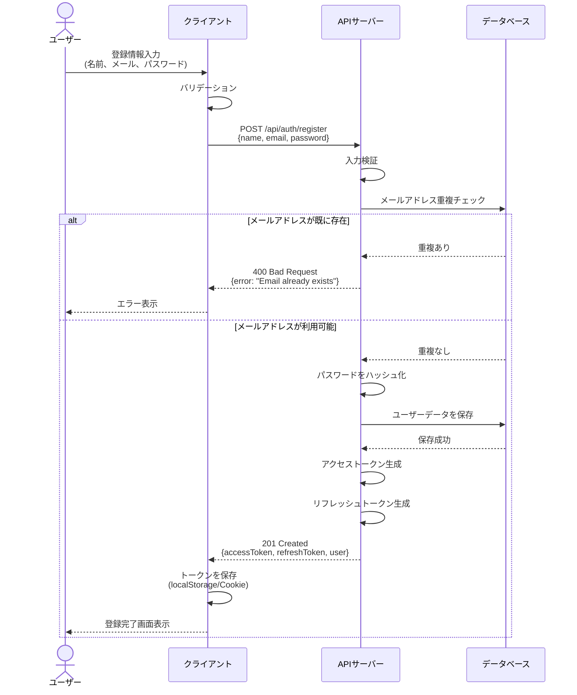
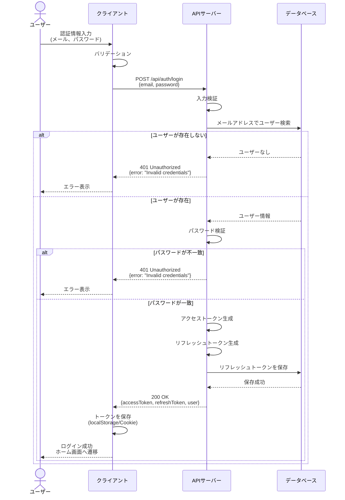
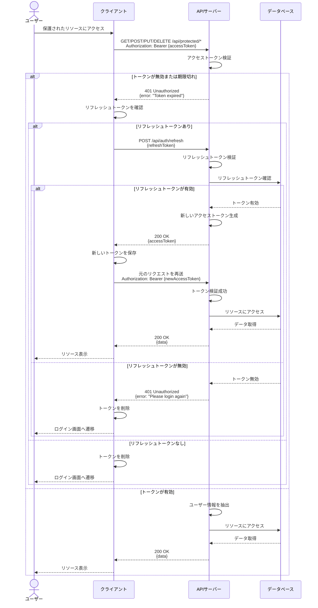

# 認証フロー

本ドキュメントでは、システムの認証関連のフローを説明します。

## 概要

認証方式にはJWT（JSON Web Token）を使用します。

- **アクセストークン**: 短期間有効（例：15分）
- **リフレッシュトークン**: 長期間有効（例：7日）

## 1. 会員登録フロー

ユーザーが新規アカウントを作成する際のフローです。

## 2. ログインフロー

登録済みユーザーがシステムにログインする際のフローです。

## 3. ログアウトフロー

ログイン中のユーザーがシステムからログアウトする際のフローです。

## 4. 要認証APIでの認証フロー

保護されたAPIエンドポイントにアクセスする際の認証フローです。

## セキュリティ考慮事項

### トークンの保存

- **アクセストークン**: HTTPOnly Cookieまたはメモリ内に保存（XSS対策）
- **リフレッシュトークン**: HTTPOnly Cookieに保存（XSS対策）

### パスワードのハッシュ化

- bcryptまたはArgon2を使用してパスワードをハッシュ化
- ソルトを使用して同じパスワードでも異なるハッシュ値になるようにする

### トークンの有効期限

- アクセストークン: 短期間（15分〜1時間）
- リフレッシュトークン: 長期間（7日〜30日）

### HTTPS通信

- 本番環境では必ずHTTPSを使用してトークンを送信

### CSRF対策

- リフレッシュトークンをCookieに保存する場合、CSRFトークンを併用

## エンドポイント一覧

| メソッド | エンドポイント | 説明 | 認証 |
|---------|-------------|------|-----|
| POST | /api/auth/register | ユーザー登録 | 不要 |
| POST | /api/auth/login | ログイン | 不要 |
| POST | /api/auth/logout | ログアウト | 必要 |
| POST | /api/auth/refresh | トークンリフレッシュ | リフレッシュトークン |
| GET | /api/auth/me | 現在のユーザー情報取得 | 必要 |

## エラーコード

| コード | 説明 |
|-------|------|
| 400 | バリデーションエラー |
| 401 | 認証エラー（未認証、トークン無効） |
| 403 | 認可エラー（権限不足） |
| 409 | リソース競合 （メールアドレス重複など） |
| 500 | サーバーエラー |
